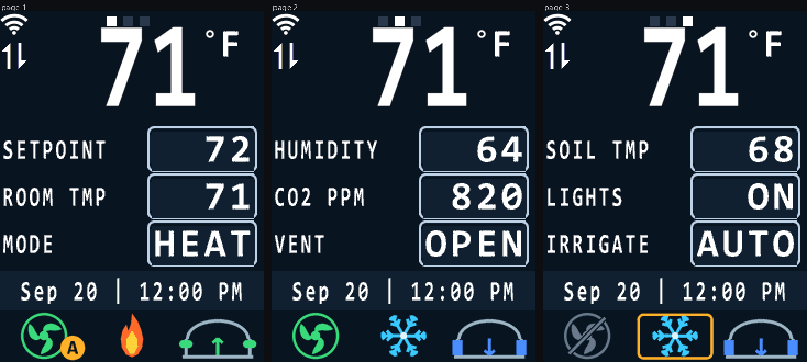
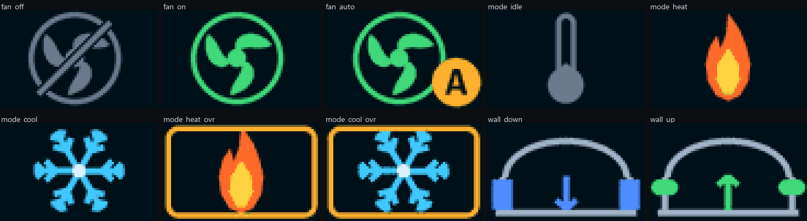

# T3 Programmable Controller — STM32

Work to update this firmware for the older STM32 based Temco products. It started
with the display, then became a pass over memory safety, the UART receive paths,
the PID loop and the Control Basic interpreter. This is a fork; everything here is
developed and reviewed on the fork rather than upstream.

## Status

As of 2026-09-25, `main` carries all of the work below.

- **Build:** `Tstat10_wifi`, 0 errors, 461 warnings. `tools/checkmap.py` passes.
- **Hardware:** `rev68VPF` to `rev68VPF4` run on the unit. `rev68VPF2`,
  `rev68VPF3` and `rev68VPF4` were flashed and confirmed working on 2026-09-25.
  `rev68VPF5` (the T3-OEM key scheme), `rev68VPF6` (the unit no longer
  blinks), `rev68VPF7` (network reads and writes bounded), `rev68VPF8`
  (power-cut-safe saves), `rev68VPF9` (no `.0` on whole values),
  `rev68VPF10` (two bugs behind compiler warnings) and `rev68VPF11` (programs
  kept inside their own memory) are built but **not yet flashed**. The targeted checks in
  [On the bench](#on-the-bench) are still open.

| image | adds | md5 | hardware |
| --- | --- | --- | --- |
| `rev68VPF` | the display work | `03889122…` | boots and draws |
| `rev68VPF2` | `RW_IRAM1` based at `0x20002000` (#5) | `21e7c5cc…` | works |
| `rev68VPF3` | memory safety, UART races, PID derivative (#6, #7) | `43889d83…` | works |
| `rev68VPF4` | cap on nested array indexes, three index bounds (#8) | `de1f5e18…` | works |
| `rev68VPF5` | the keys as arrows on a T3-OEM | `8eec914c…` | untested |
| `rev68VPF6` | the top-area unit no longer blinks | `b142d299…` | untested |
| `rev68VPF7` | private-transfer reads and writes bounded to their tables | `5f3bcb45…` | untested |
| `rev68VPF8` | program code and settings saves survive a power cut | `69f28185…` | untested |
| `rev68VPF9` | T3-OEM value boxes drop the `.0` from whole values | `4cfb9408…` | untested |
| `rev68VPF10` | oversize private-transfer reads refused; MS/TP invoke id kept signed | `47655cc0…` | untested |
| `rev68VPF11` | the program interpreter confined to each program's own row | `4e372340…` | untested — **this is `main`** |

All eleven are in `arm/OBJ/` as `Tstat10_arm_rev68VPF*.hex`. `rev68VPF11` carries
everything; `rev68VPF4` is the newest one confirmed on the unit and the fallback.
The
md5s are of a Windows checkout, where `core.autocrlf` gives the hex files CRLF
line endings. The blobs in git have LF and hash differently. The application is
linked above the bootloader, so a bad image leaves the device recoverable through
the bootloader's ISP window at power-on.

The most urgent open item is now that **Control Basic's `ON` and `COM1` do not work
on a T3-OEM**; see [To do](#to-do).

## The idle screen



Rendered by `tools/screenshot.py` from the firmware's own font tables, icon
arrays and colour constants — not a mockup.

Every image from `rev68VPF` on boots on hardware and draws the screen. That
confirms the firmware runs and renders. It does not confirm the layout matches
these pictures pixel for pixel.
The state icons and the corner humidity have not been driven yet, because nothing
writes VAR25-28.

## Scope

The MCU is an STM32F103ZE. The application is linked at `0x08008000` — the
bootloader lives below that and is **not** part of this repository.

There are three Keil targets under `arm/USER/`:

| Project | Target |
| --- | --- |
| `Tstat10_wifi.uvprojx` | `ARM_TSTAT_WIFI` — the thermostat with the LCD |
| `mini_arm.uvprojx` | `ARM_MINI` |
| `CM5_arm.uvprojx` | `ARM_CM5` |

All display work so far is confined to the `Tstat10_wifi` build: `arm/MENU/*` and
`arm/HARDWARE/LCD/ER-TFT024-3_4-Wire_SPI.c` are only compiled there. The panel is
240x320 over SPI in RGB565.

The screen only runs on a board whose `mini_type` is `MINI_TSTAT10` (9) or
`MINI_T10P` (11) — see the gate in `common/main.c` around `LCD_Intial()`. T3000
labels type 11 "T3-OEM".

## Display changes

### Paged idle screen

The main screen kept its layout, but the three rows are no longer locked to
VAR1-VAR3. Each page shows the next three VARs, so a program can drive up to
`PAGE_MARK_MAX * IDLE_PAGE_ROWS` = 24 values instead of three.

- **RIGHT** steps to the next page and wraps. This key did nothing on the idle
  screen before.
- **LEFT** still picks a row within the page; **LEFT+RIGHT** still opens the menu.
- That is the Tstat10. A T3-OEM uses the keys as arrows instead; see
  [Keys on a T3-OEM](#keys-on-a-t3-oem).
- Pages past the last VAR that carries a label are not offered, so a panel that
  labels VAR1-VAR6 gets two pages rather than eight.
- A column of marks in the top right corner shows which page is up, one per
  page that exists. It is hidden when there is only one page.

### Keys on a T3-OEM

On a T3-OEM the Tstat10 scheme read as broken: LEFT walked the highlight down the
rows, so it "acted as down", and UP/DOWN changed a value rather than moving
anything, so they "did nothing". A diagnostic image showed on the unit which pin
each key pulls: PA15 LEFT, PA13 UP, PA14 DOWN, PA12 RIGHT. That is exactly what
`key/key.c` expects, so the keys were never miswired. What was wrong was the
scheme.

So on a T3-OEM (`ARROW_KEYS()` in `arm/MENU/Menu.h`, which tests for
`MINI_T10P`), the keys work as arrows:

| state | UP / DOWN | RIGHT | LEFT |
| --- | --- | --- | --- |
| nothing highlighted | highlight the bottom / top row | next page | previous page |
| row highlighted | move the highlight, wrapping | edit the row | drop the highlight |
| editing | change the value | done | done |

- **Editing** frames the value box in amber. UP/DOWN do what they always did to
  a value: step a multi-state VAR to the next or previous named state, flip a
  digital one, or add or take away 1 from an analog one, 10 once the key has
  been held for three seconds.
- **The highlight** passes through the top area when it shows a digital point,
  as LEFT did. It clears after about three seconds without a key. An edit ends
  after about ten.
- **A held key** repeats as before, but the key task marks the repeats
  `KEY_REPEAT` on a T3-OEM. Holding RIGHT therefore keeps paging but cannot
  flicker an edit on and off. Holding UP on a digital point does not toggle it
  over and over. Every other screen masks the bit off with `KEY_SPEED_MASK`.
- **LEFT+RIGHT** still opens the menu. Unless both keys land in the same scan,
  the first one is acted on alone and the pair only arrives as a held repeat
  after about two seconds. That has always been so.
- **In the menu**, DOWN goes to the next item and UP back, like a list.

A Tstat10 keeps Temco's scheme exactly. The one thing this fixes only on a
T3-OEM is that UP/DOWN with nothing highlighted silently toggled the top-area
point; see [To do](#to-do).

### Dark palette

`TSTAT8_BACK_COLOR` and friends were retuned to a dark scheme. Because
`disp_icon()` ignores its colour arguments and blits literal RGB565, every icon
carried the old background baked into it, so all 25 icon arrays were recomposited
against the new background rather than colour-replaced — see `recolour_icons.py`
below.

### A real typeface, antialiased

The bitmap fonts were regenerated from Consolas Bold at the sizes the firmware
already used, keeping the cap height and cap top row so nothing moved on screen.

They also stopped being one bit per pixel. A glyph now stores a coverage level
per pixel and the renderer turns it into a colour through a palette interpolated
between `dcolor` and `bgcolor`, built once per character, so a pixel costs a
table lookup rather than a blend. The big top number carries 4 bits per pixel
because it is the text the eye goes to and it is only twelve glyphs; the three
smaller tables carry 2, where nearly all of the benefit is. Going from 1 bit to 2
removes the staircase; 2 to 4 only refines an edge that already reads as smooth.

### Full length row labels

`Str_variable_point.label` is nine bytes, but the rows only ever drew three of
them, so a point called `SETPOINT` read as `SET`. They now draw all eight.

`draw_tangle()` puts the value box at x=134, so the label owns x=0..133; eight
12-dot cells from x=2 end at x=97. Twelve is both the widest cell that fits eight
characters and about the narrowest that stays legible, so `char_12_24` is the same
face at the same cap height as `char_16_24`, condensed to 0.68.

Labels come from the VAR label field in T3000 — until you set them there, the rows
still read `SET`, `ROO`, `MOD`, just in the narrower face.

### Whole degrees and four character values

The displayed temperatures are only ever whole numbers, so the big top number
drops the decimal point: it rounds the tenths the sensor path carries, clamps to
three digits and right aligns with leading blanks. `THIRD_CH_POS` moved back to
`SECOND_CH_POS + 48` now that nothing sits between the digits.

The value boxes hold four characters (`VALUE_CHARS`) instead of five, which is
enough for `HEAT`, `AUTO`, `OPEN`, `72`. `draw_tangle()` takes a width rather
than assuming one, and the box is anchored to the right edge because the page
marks no longer live there. The 44 state words were shortened to fit, which also
retired the original `NAORM` typo.

### Decimals in the value boxes on a T3-OEM

A value box shows as many decimals as fit in its four cells, so a setpoint
stepped on the unit, which is always whole, read `72.0`. On a T3-OEM the boxes
follow a mode instead, held in Modbus holding register **737** and saved in
EEPROM byte 239:

| register 737 | shows | 72.0 | 21.5 | -3.0 |
| --- | --- | --- | --- | --- |
| `0` | as many decimals as fit, as before | `72.0` | `21.5` | `-3.0` |
| `1` (default) | drops a fraction that is all zeros | `72` | `21.5` | `-3` |
| `2` | whole numbers only | `72` | `22` | `-3` |

Write it with function 06 or 16 from T3000's Modbus Poll or register-write
tool, or any Modbus master; any other value is ignored. A unit
that predates the option reads the unwritten EEPROM byte as `0xFF` and gets the
default, and a factory reset restores it. The register sits beside the
display-disable option at 729. It applies to the value boxes only; the big
top-area number was already whole degrees. A Tstat10 always shows mode `0`,
and on a Tstat10 register 737 is still the remote-input register it always was.

In mode `1` a reading that changes, rather than a setpoint, jumps a column when
it lands on a whole number: `71.9`, then `  72`, then `72.1`. Mode `0` keeps it
steady.

### The link corner, the unit and the value boxes

The wifi bars moved from the top right to the top left, with the RS485 send and
receive arrows stacked underneath them, so everything about the link is in one
corner. Both sit left of `FIRST_CH_POS`, which is x=39, so the column is clear
of the big number for its whole height.

The unit moved from the foot of the number to its cap line. That needs two
constants, not one, because both faces ink below the top of their cell by
different amounts. `UNIT_YPOS` is the digits' cap line, nine rows into their 96
dot cell; the degree ring is a raw 14x14 bitmap with no padding, so it is drawn
straight at that line, while the letter beside it is a 24x36 cell that inks four
rows in and so starts at `UNIT_TEXT_YPOS`, four rows above. All three ink tops
then land on the same row.

The value text drops two dots (`VALUE_YOFF`) so that its ink centres in the box:
`draw_tangle()` runs the box from y-3 to y+40 and the 15x30 face inks rows 4 to
28 of its cell, which sits two dots high without the offset.

A value shorter than four characters is now right justified, so the units column
of a number stays in one place as the number grows. That also fixed a repaint
bug: `sprintf` leaves a terminator part way along the buffer, which stopped
`disp_str()` before it repainted the rest of the box, so going from `AUTO` to
`72` left `TO` behind. `justify_value()` squares the full width off with spaces
before shifting.

### The corner strip

The big number moved left to x=30, which centres a two digit reading on the
screen and opens a 30 dot strip down the left edge. The strip carries the wifi
bars, the RS485 arrows under them, and a humidity readout under those, labelled
`RH` with the value and its percent sign together on one line.

Three characters do not fit across 30 dots in the 12 dot face: the third cell
would start at x=36 and the first digit cell repaints from x=30 on every refresh,
erasing it. `char_10_24` is the same face at 10 dots, where three cells land
exactly on 0..29.

Moving the number also moved the minus sign. It used to be drawn on its own at
x=6, which is now underneath the RS485 arrows, so it rides in the cell left of
the first digit instead -- the 48x96 table already carries a `-` glyph. A three
digit negative has no cell left for the sign, so the magnitude is capped at two
digits when the value is negative.

Humidity comes from `TOP_RH_VAR` (VAR28), following the three icon VARs and
carrying whole percent in `value/1000`, the same convention. A value outside
0..99 draws blank rather than a wrong number.

Two things in `fontgen.py` came out of fitting that face. A table can now name
the characters that set its condense factor, because squeezing a 10 dot cell to
hold `@` and `W` clipped the ink off `%`, which is the one glyph the readout
exists to draw. And the ink is centred inside the columns that are kept, 1 to
`ink_w`, rather than inside the whole cell — column 0 is always cleared, so the
two only agree when `w - ink_w` is even, and at 10 dots it hung half a column off
each end. That change is a no-op for the four older tables, which was checked by
regenerating them against the committed arrays.

### Three things the layout work uncovered

None of these were introduced by the new layout; all three were made reachable
or visible by it.

**The value format overran the box.** `"%.1f"` needs five cells for `-12.5` and
for `123.4` alike, and the old code let `sprintf` write them and then cut at
four, leaving `-12.` and `123.` -- a dangling point that reads as a broken
number rather than a rounded one. `format_value()` picks the number of decimals
from what will fit, measures the result because rounding can carry into a new
digit (`9.996` at two places is `10.00`), and drops places until it does.

**A two character unit sat on the hundreds digit.** `"%R"`, `"pp"`, `"kP"` and
`"Pa"` were drawn at `UNIT_POS - 23`, which is x=166 -- inside the third digit
cell. They start at `UNIT2_POS` now, where the digits end, and still finish six
dots clear of the page marks. After each draw, whatever part of the unit band the
new unit does not cover is blanked, so switching from a two character unit to a
one character one cannot leave a tail. The band was first wiped whole before each
draw, which left it empty for a moment on every refresh: the unit blinked about
once a second. Drawing first and blanking only the rest never shows a gap,
because a glyph cell repaints its own background.

**`display_dec()` cut a notch out of the third digit.** It painted an 8x8
rectangle at x=130 to hide the decimal point, which was between the digits in
the old geometry. Moving the number left put that rectangle inside the third
digit cell, where it erased rows 85..87 of the glyph. There is no decimal point
on the big number any more, so the function is gone rather than repositioned.

### A clock instead of scrolling text

`display_clock()` draws `Sep 20 | 12:00 PM` in the 12-dot face — date and time on
one line, in the band the scrolling message used to occupy.

### Three state icons



The old row of five icons — day/night, home/away, heat/cool, a fan blade and a
fan speed bar — is replaced by three larger ones: what the circulation fans are
doing, what the room is calling for, and where the greenhouse sidewalls are.

Each is a 4 bit per pixel index map with its own sixteen entry palette, packed
the way the glyphs are: two pixels to a byte, low nibble first, straight across
the row boundaries. Indexed colour costs a third of what the literal RGB565
icons cost even at a larger cell: 1,620 bytes against the 4,950 a 55x45 literal
icon took. All ten states together come to 16 KB, against the 41 KB the twelve
arrays they replace came to — and each one still has sixteen colours to spend.

The palettes are built rather than quantised. Each icon names the two or three
hues it draws with, and the sixteen entries are the background plus an even ramp
to each hue. An antialiased edge is exactly a blend between the background and
one hue, so it lands on a ramp entry by construction instead of on whatever a
median cut happened to pick.

Which state each icon shows comes from a VAR, so a Control Basic program or T3000
drives them with no protocol change. These sit just past the paged rows, so a
page can never reach them. A digital VAR contributes its control bit, an
analogue one the whole part of its value, and anything out of range reads as
state 0 — an unconfigured panel shows fan off, idle, walls down.

| VAR | Shows | States |
| --- | --- | --- |
| VAR25 | circulation fan | 0 off, 1 on, 2 auto |
| VAR26 | call | 0 idle, 1 heat, 2 cool, 3 heat override, 4 cool override |
| VAR27 | sidewalls | 0 down, 1 up |

The override states draw the same flame or snowflake inside an amber frame, so
"cooling" and "cooling because someone said so" are one glance apart.

## Tools

`tools/` holds the scripts that generate the tables in
`arm/HARDWARE/LCD/ER-TFT024-3_4-Wire_SPI.c`. They are run from the repository
root and need Python 3 with Pillow.

| Script | What it does |
| --- | --- |
| `lcddata.py` | Shared reader for the arrays and `#define`s. Not run directly. |
| `fontgen.py` | Regenerates the five bitmap font tables from a TrueType face. |
| `icongen.py` | Generates the ten state icons and their palettes. |
| `recolour_icons.py` | Recomposites the legacy RGB565 icon bitmaps for a new screen background. |
| `screenshot.py` | Renders the idle screen to a PNG from the real arrays. |
| `checkmap.py` | Fails a link that puts data where the stack lives. Run before flashing. |
| `check_programs.py` | Walks compiled Control Basic programs the way `decode.c` does and checks every offset they carry. |
| `decode_harness/run.py` | Runs real and damaged programs through `decode.c` before and after a change, on the PC, and compares. |

```bash
python tools/fontgen.py                       # report the fit, change nothing
python tools/fontgen.py --write               # replace the arrays
python tools/icongen.py --sheet icons.png     # draw every state, change nothing
python tools/icongen.py --write
python tools/recolour_icons.py --bg "#0D1520" --write
python tools/screenshot.py out.png --labels "SETPOINT,ROOM TMP,MODE" --values "72,71,HEAT" --icons "fan_auto,mode_heat,wall_up"
python tools/check_programs.py "Database/temp/271203.prog"
python tools/decode_harness/run.py --base main "Database/temp/271203.prog" ...
```

`check_programs.py` and `decode_harness/run.py` take T3000 configuration files
(`.prog`), which hold a panel's compiled programs; T3000 keeps one per device in
its `Database/temp` folder. `run.py` needs Visual Studio's C compiler, which it
uses to build `decode.c` as 32-bit x86 against stand-in headers in
`tools/decode_harness/inc`. What they found is in
[A program stays in its row](#a-program-stays-in-its-row).

Three things about these are worth knowing before changing them.

`fontgen.py` proves its bit packing by re-encoding the arrays **as they were
committed at 1 bit per pixel** and comparing byte for byte, before it generates
anything. Those arrays were consumed correctly by the shipped renderer, so this
is an independent check of the packing machinery rather than the packer agreeing
with itself. That check stands in for hardware testing and should be kept.

Nothing in that proves the multi-bit field order matches what the C renderers
extract. That is checked by rendering: `screenshot.py` unpacks with the same
convention, so a disagreement shows up as visibly mangled text or icons.

`lcddata.py` tokenises arrays on commas and resolves `#define`d names, raising on
anything it cannot resolve. This matters because the four corner pieces used by
`draw_tangle()` mix hex literals with colour names — a hex-only parser silently
returns 58 of `leftup`'s 64 pixels and corrupts the frame corners.

`recolour_icons.py` only applies to the literal RGB565 icons. The state icons
need no recolouring: `icongen.py` reads `TSTAT8_BACK_COLOR` and rebuilds the
ramps against it, so changing the background means re-running it.

`screenshot.py` models the drawing, not the erasing. It will not catch a clear
rectangle left at the wrong size or position, so any change to the cell geometry
has to update every `disp_null_icon()` that wipes it by hand.

What it does model, it has to model exactly, because it is the only check this
work has. It carries mirrors of `format_value()`, `justify_value()` and the
tenths rounding rather than Python equivalents of them: `str.rjust()` is not
`justify_value()`, because it keeps the trailing spaces a memcpy'd literal like
`"ON  "` carries, and `round()` is not `(value + 5) / 10`, because it rounds half
to even and disagrees on every `.5`. `--unit` takes the firmware's own branch
names so that `RH` draws `%R` rather than `RH`, and `--values` sends anything
numeric through `format_value` instead of accepting a pre-formatted string. A
short icon array and a page count over `PAGE_MARK_MAX` are errors rather than
silently clipped, since both corrupt the panel write on hardware.

## Building

Keil MDK, ARMCC V5.06. Headless:

```bash
"C:/Keil_v5/UV4/UV4.exe" -r arm/USER/Tstat10_wifi.uvprojx -o build.log
```

Use `-r` (full rebuild) rather than `-b` when comparing warning counts, or you are
comparing an incremental build against a full one. Do not pass `-j1`; UV4 does not
accept it and blocks on a dialog instead of failing.

Notes on the toolchain:

- The prebuilt BACnet library links from `bacnet/bacnet_ARM_revXX_T10.lib`
  inside the repository. Temco's projects named it as
  `..\..\..\BACLIB\bacnet_ARM_revXX_T10.lib`, a folder *next to* the repository,
  so a fresh clone could not link until someone created that folder by hand.
  `Tstat10_wifi.uvprojx` now points at the in-repo copy (same md5; the rebuilt hex
  was byte-identical). `mini_arm.uvprojx` and `CM5_arm.uvprojx` still point at
  `BACLIB`, and CM5's `bacnet_ARM_rev10_mini.lib` is not in the repository at all.
- UV4 rewrites `Tstat10_wifi.uvprojx` on build to match the locally installed
  compiler and device pack. That drift should not be committed.
- The scatter file is **generated** from the target dialog, not hand written, so
  the memory map is edited through the `OCR_RVCT` entries in the project rather
  than in `arm/OBJ/Tstat10_arm_revxx.sct`. The `<ScatterFile>` entry naming
  `..\OBJ	est.sct` is a stale leftover; no such file exists and nothing reads it.
- **The stack is invisible to the linker, and the memory map has to work around
  it.** `arm/CORE/startup_stm32f10x_hd.s` builds with `DATA_IN_ExtSRAM EQU 1`
  and writes an absolute stack pointer rather than using the one the linker
  placed:

  ```asm
  __initial_sp EQU 0X20000000 + Stack_Size    ; 0x20002000
  ```

  Nothing then references `Stack_Mem`, so the linker discards the section --
  `Removing startup_stm32f10x_hd.o(STACK), (8192 bytes)` in the map -- and stops
  believing anything occupies internal SRAM. The stack is real: 8 KB growing
  down from `0x20002000`. The linker just cannot see it.

  This used to be hidden by `RW_RAM1` being declared as `0x800000` against a
  512 KB part, which swallowed every byte of RW and ZI and left internal SRAM
  empty by accident. Declaring it at its real size ended the accident: the
  linker filled `0x20000000`-`0x20005358` straight through the stack, `__main`
  zeroed live stack frames during its ZI sweep, and the first device flashed
  with that build never left its bootloader.

  The fix is to reserve the stack rather than to hide it. `RW_IRAM1` is based at
  `0x20002000` with size `0xE000`, so the 8 KB below it belongs to the stack
  alone, and `RW_RAM1` carries its real `0x80000` -- which puts the overflow
  check back, on a region that runs about 92% full.

  **Run `tools/checkmap.py` before handing anyone a hex.** It fails the build
  configuration that would not boot, by both the region base and the placement
  addresses, and warns when a region passes 95% full.
- The `Tstat10_wifi` build outputs are committed with the source that produced
  them: `arm/OBJ/Tstat10_arm_revxx.hex`, `.axf`, `.map`, the call graph `.htm` and
  `.build_log.htm`. So every commit carries its own map and stack analysis, and a
  change that moves memory or stack shows up in the diff. Rebuild and commit them
  together with any source change.

  The hex covers `0x08008000`-`0x08054bdb`, with the entry point at `0x08008131`.
  That is the application only. The bootloader lives below `0x08008000`, is not
  in this repository and is not touched by flashing this file, so a bad
  application still leaves the device recoverable through the ISP window. Images
  meant for a device are also copied to `Tstat10_arm_rev68VPF*.hex`; see
  [Status](#status).

Current state of the `Tstat10_wifi` target: **0 errors, 461 warnings**.

| Region | Used | Of | Free |
| --- | --- | --- | --- |
| `ER_IROM1` flash | `0x4cfa0` (315,296) | `0x60000` | ~76 KB |
| `RW_RAM1` external SRAM | `0x763f8` (484,344) | `0x80000` | ~39 KB (92.4% full) |
| `RW_IRAM1` internal SRAM | `0x43f0` (17,392) | `0xe000` | ~39 KB |

`RW_IRAM1`'s `Of` column is `0xe000` rather than the `0x10000` the chip carries,
because the 8 KB below `0x20002000` is reserved for the stack the linker cannot
see. See the note above.

Flash went down about 25 KB across the icon change: the twelve literal RGB565
icons that nothing draws any more came to roughly 41 KB, against 16 KB for the
ten indexed ones that replaced them. They were deleted from the source rather
than left to the linker, which does not reliably strip unreferenced const data.

Internal SRAM is in use again, and that part is a genuine win: about 17 KB now
lands there, on a region that had been sitting entirely empty because `.ANY`
swept everything into the oversized external one. Internal SRAM is single cycle
where the FSMC part is not.

What matters is *where* it lands. An earlier revision of this file said the same
thing about simply capping `RW_RAM1`, and that advice was wrong in a way that
cost a device: capping it alone let the linker fill from `0x20000000` upward,
straight through the invisible stack, and the board never left its bootloader.
The speed was never the problem; the placement was. Basing `RW_IRAM1` at
`0x20002000` keeps the benefit and puts the data above the stack instead of on
top of it.

## Things that are not what they look like

Four traps in this tree have each cost real time, and none of them announce
themselves.

**A sizing constant in a header may not reach the binary.** `tsm.o` and
`address.o` come from `bacnet/bacnet_ARM_revXX_T10.lib`, a prebuilt 29 MB static
library whose sources are not in this repository. Editing `MAX_TSM_TRANSACTIONS`
in `bacnet/bacnet.h` does not change its RAM, and somebody has already tried.
Before quoting any `bacnet.h` constant as though it describes the image, check
the actual symbol size in `arm/OBJ/Tstat10_arm_revxx.map`.

**Task stack sizes are in words, not bytes.** `portSTACK_TYPE` is `uint32_t`, so
`xTaskCreate(..., 1000, ...)` asks for 4,000 bytes. `sTaskCreate` is just
`xTaskCreate` (`common/product.h:170`). Reading it as bytes is how two tasks ended
up short: `WifiSTACK_SIZE` was 1000 with 2048 commented out beside it, and
`MainSerialSTACK_SIZE` was 1024. Both are 2048 now; see
[Memory safety](#memory-safety).

**The Keil call graph holds the stack analysis, and it is checked in.**
`arm/OBJ/Tstat10_arm_revxx.htm` carries `Maximum Stack Usage` plus a per-root
`[Stack]Max Depth` for every entry point, so each task can be measured against
its own stack:

```bash
sed 's/<[^>]*>//g' arm/OBJ/Tstat10_arm_revxx.htm > cg.txt
grep -iE 'Maximum Stack Usage|Mutually Recursive' cg.txt
grep -oE '\[Stack\]Max Depth = [0-9]+Call Chain = [A-Za-z_][A-Za-z_0-9]*' cg.txt
```

Read the `+ Unknown(Cycles, Untraceable Function Pointers)` on that figure
seriously. The Control Basic interpreter recurses once per nested array index,
so its depth is set by the program a user downloads. That is now capped — see
[Nested array indexes](#nested-array-indexes) — and the call graph's only
interpreter cycle is `eval_index ⇒ veval_exp`. If another interpreter cycle
appears there, it is a recursion path that goes around the cap.

**Half the tree is not compiled.** The project compiles 91 source files (89 C,
2 assembly) and links two prebuilt libraries. The whole `asix/` directory,
`arm/uIP*`, `common/comm.c` and `arm/USER/TestTool_MiniT/` are not among them, and `asix/` in particular holds near-copies of `modbus.c`,
`flash_user.c` and others that are easy to edit by mistake. The compiled set is
whatever `<FilePath>` entries appear in `arm/USER/Tstat10_wifi.uvprojx`; resolve
them relative to `arm/USER/`.

## Memory safety

FreeRTOS now reports rather than absorbs two classes of failure.
`configCHECK_FOR_STACK_OVERFLOW` is `2` and `configUSE_MALLOC_FAILED_HOOK` is
`1`; both hooks are in `common/main.c` and both `SoftReset()`. They record
nothing, because RAM does not survive the reset: to see which task overran, set a
breakpoint in `vApplicationStackOverflowHook` and read `pcTaskName`. Neither
check was enabled before, so a task that ran off its stack
corrupted whatever the heap had placed below it and carried on, and a task that
could not get a stack simply never ran — every `xTaskCreate` here discards its
return value.

**This converts silent faults into visible restarts.** A board that starts
cycling after this change is reporting a fault it always had.

Twelve tasks are linked into this build, and their stacks take 51,232 bytes of
the 60 KB heap (83.4%). TCBs, queues and semaphores come out of the other
10,208 — roughly 2 KB of it — which leaves about 8 KB. `heap_2` cannot coalesce
freed blocks, which is survivable only because every task here is created once
at startup and never deleted. The heap is only drawn on at boot, so a stack that
does not fit shows up as a reset loop on the first power-up rather than later.

| task | stack (bytes) | deepest traced call chain | margin |
| --- | ---: | ---: | ---: |
| `main_dealwithData` | 8,192 | 4,160 | 2.0× |
| `WIFI_task` | 8,192 | 4,344 | 1.9× |
| `Master_Node_task` | 8,192 | 4,312 | 1.9× |
| `Bacnet_Control` | 8,192 | 3,104 + 208 per nested index, 4,768 at the cap | 1.7× at the cap |
| `ScanTask` | 8,192 | 476 | 17× |
| `Monitor_Task_task` | 4,000 | 388 | 10× |
| `refresh_Input_Task` | 2,000 | 312 | 6.4× |
| `MenuTask` | 1,536 | 144 | 11× |
| `Common_task` | 1,024 | 136 | 7.5× |
| `refresh_Output_Task` | 800 | 80 | 10× |
| idle | 512 | 88 | 5.8× |
| `Key_Process` | 400 | 128 | 3.1× |

Depths are the `[Stack]Max Depth` figures from Keil's call graph
(`arm/OBJ/Tstat10_arm_revxx.htm`), which cannot see through function pointers
or recursion, so they are floors. Each interrupt taken while a task runs also
pushes 32 bytes onto that task's stack. Find the tasks from the callers of
`xTaskGenericCreate` in the same file rather than by grepping the source: an
earlier count from the source missed five of them, and one of the five,
`main_dealwithData`, had 4,096 bytes for a 4,160-byte chain. It now has 2048
words.

Unbounded copies reachable from the network were closed at the same time: three
in `decode.c`, where a one-byte length from program bytecode was memcpy'd into a
94-byte buffer; two in `ptransfer.c`, where a 16-bit `total_length` off the wire
sized copies into 300-byte buffers; and a `strcpy` in `alarm.c` that put that
94-byte message into a 59-byte field. Two format buffers that could not hold
their own output were resized (`alarm.c`, `scan.c`); a `memcpy(..., 0, ...)`
reading from address 0 became the `memset` it was meant to be; `GET_PANEL_INFO`
stopped dereferencing a pointer one line before assigning it, and now assembles
the device instance with its two halves the right way round; three places
stopped indexing `remote_points_list[128]` with the `0xff` "idle" sentinel, two
reads in `ptransfer.c` and a block of writes in `main.c` that landed ~3.5 KB past
the end of the table after every panel scan; and an
`if(count >= 0)` on an unsigned count stopped guarding a division by it. The
sound level still reads the table's floor of 50 in a silent room, as it always
has; it just no longer gets there by dividing by zero.

That pass did not reach every copy the network drives. The private-transfer
writes into the other point tables were bounded later; see
[Private transfer bounds](#private-transfer-bounds).

The `decode.c` clamp covers the copy into `message[]` only. `prog += len` still
steps by the original length, because that byte is part of the instruction
stream whether or not it was sane, and `ALARM` and `DALARM` write to the program
just past the message — a state byte and a 4-byte delay counter. Both check that
step against the program's 2,000-byte row before writing, as every write into a
program now does; see [A program stays in its row](#a-program-stays-in-its-row).
`ALARM` also stopped writing through a `NULL` when its comparison operator is
missing.

Alarm messages are stored truncated to 58 characters, so the lookups that find
an existing alarm (`checkforalarm`, `dalarmrestore`) now compare on the same 58.
Against the full text a long message never matched its own stored copy: it was
filed again on every scan until the table filled, and could never be restored.

One of those fixes was wrong the first time, in a way worth repeating. The
`ptransfer.c` guard was put inside `Get_Pkt_Bac_to_Modbus`, which is called
*after* the caller has already filled `bacnet_to_modbus` — so it ran after the
overflow it was meant to stop. A bounds check is only a bounds check if it
precedes the write it guards.

### A critical section does not mask the UART here

`uart0/1/2_rece_count` are written by the USART receive ISRs and read by tasks,
and are now `volatile`. That is the smaller half of the problem. The receive ISR
appends to its buffer and, on a complete frame, sets the count back to zero and
starts the next frame at index 0 — so a `memcpy` out of that buffer which
straddles the reset returns the tail of one frame spliced onto the head of the
next. `volatile` does nothing about interleaving.

Neither does `taskENTER_CRITICAL`. USART1, USART2 and USART3 are all installed at
**NVIC pre-emption priority 0** (`usart.c:129`, `223`, `321`), while
`configMAX_SYSCALL_INTERRUPT_PRIORITY` is 191. A critical section only raises
`BASEPRI` to that threshold, which leaves a priority 0 handler free to run
straight through it. Anything that must be atomic against a receive ISR has to
mask that interrupt by name, which `wait_subnet_response` and
`set_subnet_parameters` now do for all three ports through `uart_rx_take` and
`uart_rx_arm` in `common/modbus.c`. A byte arriving meanwhile waits in the data
register and is taken on unmask.

Mask it **at the NVIC** (`NVIC_DisableIRQ`/`NVIC_EnableIRQ`), not by clearing
`RXNEIE` with `USART_ITConfig`. The first version of this fix did the latter,
and `USART_ITConfig` is a read-modify-write of `CR1`. The USART1 ISR clears
`TXEIE` in that same register when it finishes sending a frame, so if it lands
between the task's read and write, the task writes the stale `TXEIE` back, the
ISR fires again and puts a stray byte on the RS-485 bus just as the slave starts
to answer. `ICER` and `ISER` are write-one-to-clear and write-one-to-set, so
there is nothing to lose.

The same priority arrangement means those ISRs **must not call any FreeRTOS
`…FromISR` function**. They currently do not. Keep it that way, or lower the
priority to at or below the threshold first.

### The PID derivative

`pid_controller` zeroed `erp` between the proportional and integral terms, so the
derivative block — which wants `erp - old_err * 100 / prop` — got
`0 - old_err * 100 / prop`: the negated previous error rather than the change.
The term tracked the level of the error instead of its movement, which meant a
constant push at a steady offset and the wrong sign on a rising error. It also
divided by `prop` without the guard the proportional term applies to itself.

It now works from the change in the **measurement**, not the change in error.
With a fixed setpoint the two are the same, but a setpoint step (an
occupied/unoccupied schedule switch, say) moves the error in one sample and
would kick the output for a whole 10 s period; the measurement does not jump.
The loop's history is also re-seeded on the first sample after power-up and
after any spell in manual, so returning to auto does not see the whole drift
while it was off as a single step. The integral's trapezoid uses the same
re-seeded history.

### Nested array indexes

The Control Basic interpreter in `bacnet/private/decode.c` evaluates postfix
bytecode on a bounded value stack, so ordinary expressions do not recurse
however many brackets they have. Array indexes do: reading `AY1[expr]` evaluates
`expr` in a fresh `veval_exp`, and an index can itself contain an array read.
Nothing limited how deep that goes. T3000's compiler accepts any depth, and
`WRITEPROGRAMCODE_T3000` stores whatever bytes it is sent. A 2,000-byte program
row has room for well over a hundred levels.

Each level costs 208 bytes of the `Bacnet_Control` task's 8 KB stack, which
already runs 3,104 deep without any, so somewhere past 25 levels it overflows.
With the overflow hook that means a reset, the program runs again once the
board is back, and after five such resets `bac_control.c` switches every program
off — a unit that has quietly stopped running its programs.

Nesting is now capped at `MAX_INDEX_DEPTH` (8), about 1.7 KB. Both recursion
edges go through `eval_index`, which counts. At the cap it `longjmp`s back to
`exec_program`, which abandons the scan and raises
`PRG n error : indexes nest too deep`. The statements before the one that nested
too deep have already run that scan, as they do when the decoder meets malformed
code, and the program stays on.

It jumps rather than returning because a normal return from the middle of an
expression leaves `prog` pointing into the middle of it. The statement that
asked for the value would then act on it: write 0 to an output, or raise an
alarm with whatever text `prog` now points at. The frames jumped over are
interpreter frames holding no locks. The one piece of state to undo is the
`Alarm` statement's habit of overwriting its comparison operator with `0xFF`
while it evaluates; the byte is recorded and put back.

The same pass bounded three indexes that came straight from the program:
- `PIDPROP`, `PIDDERIV` and `PIDINT` wrote `controllers[i - 1]` for any
  controller number the program computed.
- `get_ay_elem` read `arrays_address[]` with an unchecked byte out of the
  bytecode and then dereferenced what it found.
- `ALARM-AT` appended its panel list to the 5-byte `alarm_panel[]` on every scan.
  Nothing reset the count (the reset at the top of the scan is commented out), so
  a program using it wrote past the array within a few scans. Once the signed
  8-bit count wrapped negative, it wrote below the array too. Each `ALARM-AT`
  now replaces the list, keeping the five panels `putmessage` reads.

### A program stays in its row

A program is one 2,000-byte row of `prg_code[]`: its code, then its local
variables and its time table, each behind a 2-byte length. The interpreter reads
and writes all three, at places the bytecode gives as offsets: the three lengths,
every jump target, every local-variable and array offset, and `WAIT`'s resume
point. None of them was checked. This README said jump targets were bounded; they
were not.

A damaged program could send the interpreter anywhere within about 32 KB of its
row, and not only to read. An `IF` whose false branch lands outside the row runs
whatever it finds there as statements. `IF+`, `IF-`, `WAIT` and `INTERVAL` write
their state back into the code, and the time-table pass writes a counter for as
many entries as the table's length claims. `put_local_array` wrote each element
wherever the array's offset and its stored dimensions put it.

Every write through a bytecode offset, and every jump, is now checked against the
row first, in `in_row` and `jump_to` in `decode.c`. Outside the row the scan is
abandoned the way deep nesting is, by a `longjmp` back to `exec_program`, and the
alarm is `PRG n error : out of bounds`. What is checked:

- the three section lengths, which together have to fit the row, before anything
  is read through them;
- every jump: `GOTO`, `GOSUB`, `ON`, `ON-ALARM`, `IF`, `IF+`, `IF-`, `ELSE`, `FOR`,
  `NEXT`, `WAIT`'s resume point, and the address `RETURN` pops;
- where the next statement starts, before it is read;
- the state and counter bytes of time-table entries, `IF+`, `IF-`, `WAIT`,
  `INTERVAL`, `ALARM` and `DALARM`, and the panel list of `ALARM-AT`;
- every local-variable and array-element write.

A `RETURN` with no `GOSUB` behind it pops 0 and still ends the scan quietly, as
it always has. `put_local_var` used to refuse offsets past 500 instead of
checking against the row, which also dropped writes to real locals more than 500
bytes into a large local table. A `WAIT` resume offset past the row used to stop
the program silently on every scan; it now raises the alarm. Reads past the row
are left alone. The rows are in external SRAM, so a stray read cannot fault, and
bounding every read would mean a check in every operand.

A program T3000 compiles trips these checks only where the old interpreter
already left the row with it, which is what the harness below tests. Three such
cases are known, and all three are interpreter bugs rather than bad code:

- `COM1`, which this build does not have (one of Temco's BTU-meter examples);
- a multi-target `ON` on a program's last line, whose fall-through scan used to
  run into the next program's row and execute it (see [To do](#to-do));
- a `RETURN` in a subroutine that used `UNACK`, which leaves a value on the stack
  for `RETURN` to pop in place of the address `GOSUB` pushed.

Each now stops the scan with the alarm where it used to run on outside the row.
Everything else the compiled programs point at is inside them, and they run as
before. That was checked two ways, with the tools in [Tools](#tools), on 29
compiled programs: the three on the bench unit, the rest Temco's examples.

- `check_programs.py` walks each program as the interpreter does and checks every
  offset against the section it belongs to, which is stricter than the row. All
  pass except two that use `COM1`, which this build does not have; see
  [To do](#to-do).
- `decode_harness/run.py` builds `decode.c` from before and after this change for
  the PC and runs both on the 29, then on 4,350 damaged copies. 28 of the 29
  behave identically. The odd one is a BTU-meter program whose `COM1` sends the
  old interpreter 257 bytes back, into the previous program's row, where it ran
  what it found as statements; the new one abandons the scan. On the damaged
  copies the old interpreter wrote outside its row 333 times and the new one
  never. Every difference between the two is a scan where the old one left its
  row or the new one abandoned it.

### Private transfer bounds

`bacnet/private/ptransfer.c` serves T3000's private-transfer reads and writes,
over BACnet and, through `common/modbus.c`, over Modbus. Nothing authenticates
them, and everything that locates the data comes from the request: the first and
last entry, a 9-bit entry size, and for program code a 7-bit packet index. Only
the input, output and variable commands checked both ends of the range. The
rest:

- checked only `end <= MAX_…`, which admits one entry past the table, and never
  the start. Custom tables, multi-state values, arrays and zone writes checked
  nothing.
- then copied `total_length - 7` bytes. That only had to equal
  `entitysize × count`, and both come from the same packet, so a write could put
  about 500 bytes past `programs[]`, `controllers[]` and the rest.
- `WRITEOUTPUT` checked its range but still copied the full length the packet
  claimed.
- program code offset its copy by `400 × packet_index` into the program's row
  before any check, up to 50 KB past it.

Reads used the same headers, so they could send back whatever followed a table.

Every command now finds its destination through one of three helpers:

- a table: `start` and `end` inside it and `start <= end`, with the size taken
  from the declaration so it cannot drift from a `MAX_` constant;
- a whole object that `start` and `end` do not index;
- a program-code packet, which must start inside its program's 2,000-byte row.
  That allows packets 0 to 4.

Each notes how many bytes there are from the destination to the end of its
object. A write copies no more than that, nor more than the receive buffer holds.
A read copies no more than that and sends zeros for the rest of what was asked.
A request that fails the check is ignored, as an out-of-range input, output or
variable request always was.

T3000 asks only for ranges inside these tables. It limits a program to 2,000
bytes and sends it as at most five 400-byte packets, so nothing it sends is
refused; this was checked against its source.

Two more out-of-bounds writes turned up on the same paths:

- `READ_TSTAT_DB` lists the subdevices and panels the unit knows into
  `Remote_tst_db.sub[64]`. There can be up to `MAX_ID` (100) Modbus subdevices
  plus the remote panels, so a unit that knew more than 64 wrote past the table
  on every read. Both loops now stop when it is full.
- Writing 0 to a counting input clears its counter, and the input number indexes
  four counter arrays. Three of them have 16 entries and one has 12, but the
  number can be any input up to 63. Each write is now bounded by its own array.
  The Modbus register path in `common/modbus.c` had the same bug.

### Saves that survive a power cut

The point tables were already saved through a shadow page. `flash_replace_page`
writes the new page to a spare page first, then a commit record naming its
destination, and only then erases and rewrites the live page. If power is cut
after the record is written, `flash_finish_pending_commit` finishes the save from
the shadow copy at the next boot. Program code and four settings pages bypassed
it, and were erased and rewritten in place with interrupts off:

- `Flash_Store_Code` erased and rewrote all 16 program pages on every save,
  whichever program had changed. That kept interrupts off for up to about a
  second, and wore every page on every download.
- `FLASH_OTHER_ADDR` holds the panel name, the Wi-Fi settings and the schedules'
  on/off flags. `…ADDR2` holds the multi-state values, relinquish defaults,
  BACnet vendor strings, variable units and the display configuration, and
  `…ADDR4` the email settings. A cut while the first of these was being saved
  took the unit off the network.

Each is now built whole in RAM and saved through the shadow page, and only if it
differs from what is in flash. Downloading one program rewrites one page. The
images match byte for byte what the old field-by-field writes left, so existing
units read the same data and an unchanged page is recognised as unchanged. Boot
recovery now also accepts a program page as the destination, and refuses the
shadow pages themselves.

The output priority arrays (`…ADDR3`) stay in place, deliberately. They are
saved on every BACnet write to a binary output, so that page changes far more
often than any other. Through the shadow page, each change would also erase the
shadow page and the commit record, which every save shares; once those wore out,
every save would fail with them. In place, a cut mid-rewrite loses the stored
commands, and the outputs start at their relinquish defaults. What did change is
that the page is no longer erased on every write whether or not anything
changed. A BMS that re-sent a command once a minute erased it 1,440 times a day,
and the flash is rated for 10,000 erases.

All flash writes now also take one lock, a recursive FreeRTOS mutex. Saves start
from several tasks (the main loop, the BACnet and Modbus handlers, the Wi-Fi and
TCP/IP tasks), and nothing kept them apart:

- One save could lock the flash controller under another part way through a
  page, or overwrite the shadow copy the other was relying on.
- `Flash_Write_Mass` copies a table into a shared 20 KB buffer and writes it out
  a page at a time. A second save could refill the buffer with another table in
  between, and the first would write that table into its own pages.

Being a mutex, it makes only other saves wait. Other tasks still run between the
halfword writes of a save, and the receive ISRs are never masked. The factory
reset's erase takes it too. It is created just before the scheduler starts,
after every task, so the heap is still only drawn on at boot; until then the
lock does nothing.

### Comparisons with zero

Keil's `#186-D` flags an unsigned value compared with zero, which is always or
never true. Eight were read as a group; two were hiding bugs.

- **A reply longer than the buffer** (`ptransfer.c`). A private-transfer read
  computes its reply length as `entitysize × count`, both from the request, and
  capped it at 500 bytes with `transfer_len >= 0 && transfer_len <= 500`. The
  cap only skipped building the reply header; the handler carried on. On the
  Temco private-Modbus path it then wrote the CRC at `temp[transfer_len + 14]`,
  and when the range was invalid nothing else had looked at `transfer_len`. So a
  request could write two bytes up to about 64 KB past the 600-byte `temp[]`. An
  oversize read now gets no reply, as the handler's other overrun checks already
  do, and the CRC write is bounded to `temp[]` too.
- **A failed send taken for a sent one** (`ptransfer.c`, `scan.c`).
  `invokeid_mstp` was a `uint8_t` holding what `GetRemotePoint` and
  `Send_private_scan` return, and a failed send is `-1` or `-7`. Stored, that
  became 255 or 249. Callers then counted the send as made rather than raising
  the point's `lose_count`, and a stray reply carrying that id matched it. It is
  an `int` now, so its `>= 0` check means what it says.

Five were dead lower bounds with a real upper bound beside them (`tstat_wifi.c`
twice, `menuSet.c`, two Modbus register ranges) and were removed without any
change in behaviour. The eighth, in `user_data.c`, is on the To do list below.

## To do

Ordered by risk to a unit in the field. Checked against `main` on 2026-09-24.

### Code

1. **`ON` never jumps.** `ON X GOTO` and `ON X GOSUB` compare their selector with
   the number of targets without dividing it by 1000, so any whole `X` is out of
   range and the statement falls through. The fall-through then scans for the next
   `0x01` byte. The target count or an offset can be that byte (a one-target `ON`
   stops on its own count), and after the program's last line there is none, so
   the scan ran on through the tables behind the code and into the next
   program's row. It now stops at the end of the row with
   `PRG n error : out of bounds`, which a program with a multi-target `ON` as its
   last line will show. Temco's ESP32 port has the same code. The fix is to divide by 1000 and step over the list, but programs
   whose `ON` lines have never jumped would start jumping, so it wants a decision
   first.
2. **`COM1` is not in the T3-OEM build.** It is compiled only for `ARM_MINI` and
   `ASIX_MINI`. Here the expression evaluator cannot step over it: it spins on
   the byte for 2,000 iterations. The statement loop then reads its opcode,
   `0x10`, as `ELSE`, and jumps wherever the next two bytes say. Temco's
   BTU-meter examples use it, and on one of them that jump leaves the row, which
   now stops the scan with `PRG n error : out of bounds`. The fix is to step over `COM1`'s argument
   count and push 0 in builds without it. `tools/check_programs.py` already
   reports programs that use it.
3. **Downloaded program bytecode is not checked when it arrives.** The
   interpreter now keeps every program inside its own row (see
   [A program stays in its row](#a-program-stays-in-its-row)), so a malformed
   program no longer damages anything. It raises `PRG n error : out of bounds` on
   its first scan. Checking the row when `WRITEPROGRAMCODE_T3000` receives it
   would move that to the download. `tools/check_programs.py` is most of the
   checker. It has not yet met a real program with `FOR`/`NEXT`, `ON`, `GOSUB`,
   `WAIT` or the alarm statements, though, and a check in the download path must
   never refuse what T3000 compiles. It needs programs like those first, and
   `tools/decode_harness` to test it against the interpreter.
4. **Remote panels never leave the panel table.** `Check_Remote_Panel_Table` in
   `bacnet/private/user_data.c` counts each panel's `time_to_live` down once a
   minute and was meant to drop it below zero. The field is unsigned, so it wraps
   to 255 instead and the check never fires; a panel that goes away keeps its
   slot until restart. Turning expiry on is not a one-line fix:
   - The time to live is refreshed only when a panel is heard (`user_data.c:1342`,
     and MS/TP traffic at `1467`), so a panel that is up but quiet for about six
     minutes would be dropped and re-added.
   - The dormant deletion code skips the entry it shifts down.
   - Indexes into the table (`remote_mstp_panel_index`, the scan loop) move under
     it.

   It wants testing against a real multi-panel network before it is switched on.
5. **Alarms are never forwarded to other panels.** `sendalarm` and its callers in
   `bacnet/private/alarm.c` are commented out. The `where1…where5` destinations
   that `ALARM-AT` sets are stored with each alarm and shown in T3000, but go
   nowhere. Relatedly, `alarm_at_all` is set by `ALARM-AT ALL` and never cleared.
   The reset at the top of the scan is commented out, so it stays set until
   reboot. That is harmless while forwarding is off, and needs deciding before
   forwarding is turned back on.
6. **Two table reads take their index from a program's values.** `WR_ON` and
   `WR_OFF` index `wr_times[]` with the schedule number the program computed,
   checked only for being positive. `STATUS` indexes `current_online[]` with a
   panel number the same way. Both only read, but a large enough schedule number
   takes the first one out of RAM altogether.
7. **The `mini_arm` and `CM5_arm` targets have not been built since this work
   began.** They compile the same `decode.c`, `ptransfer.c`, `alarm.c`,
   `modbus.c` and `main.c`. Nothing here has checked that they still build, or
   that the memory-map and stack reasoning holds for them. Both still link the
   BACnet library from `..\BACLIB`, and CM5's library is missing (see
   [Building](#building)).
8. **On a Tstat10, UP/DOWN with nothing highlighted toggle the top-area point.**
   In `MenuIdle_keycope` a `disp_index` outside 1-3 falls into the branch meant
   for the top area, and `disp_index` is 0 whenever no row is highlighted, which
   is most of the time. So a stray UP or DOWN flips the `control` of whatever
   point the top area shows, and for an output also drives it with
   `set_output_raw`, whether or not the top area is showing it as a digital
   point. This is Temco's code, and it is fixed only on a T3-OEM, where the arrow
   scheme gives UP/DOWN no such path (see
   [Keys on a T3-OEM](#keys-on-a-t3-oem)). On a Tstat10 the fix is to require
   `disp_index == 4 && flag_digital_top_area` before touching the point.

### On the bench

All four images in [Status](#status) were flashed in order and work on the unit
(2026-09-25). That settles the first question each one raised:

- `rev68VPF2` boots and draws, which proves the new memory map.
- `rev68VPF3` and `rev68VPF4` run rather than reset. With overflow detection on,
  a stack or heap shortfall would show as a reset loop in the first seconds.

These checks are still open. Run them on `rev68VPF4`, which carries everything:

- RS-485 master polling returns sane values on each port in use. This covers the
  UART change.
- Loops with `rate > 0` are watched through a setpoint change (see
  [In the field](#in-the-field)).
- A program that reads `AY1[AY1[AY1[…]]]` nine deep raises
  `PRG n error : indexes nest too deep` instead of resetting the board.
- A program using `ALARM-AT` with panel numbers runs for several minutes without
  trouble.
- Check the layout against the renders by eye. `LABEL_YOFF` is the value most
  likely to need nudging.
- Step the pages with RIGHT (and back with LEFT on a T3-OEM).
- Drive VAR25-28 to see the state icons and the humidity readout change.

`rev68VPF5` to `rev68VPF11` have not been flashed. On `rev68VPF6`, the unit
beside the top-area value ("°C") should hold steady instead of blinking about once
a second. On a T3-OEM, check the keys against the table in
[Keys on a T3-OEM](#keys-on-a-t3-oem):

- UP and DOWN move the highlight both ways and wrap, and it clears by itself
  after a few seconds.
- RIGHT on a highlighted row frames its box in amber. UP/DOWN then change the
  value, and LEFT or RIGHT puts the frame back to its usual colour.
- LEFT and RIGHT page back and forward with nothing highlighted, and holding
  RIGHT on a highlighted row does not make the frame flicker.
- LEFT+RIGHT opens the menu, where DOWN goes to the next item.

`rev68VPF10` should change nothing you can see. If the unit reads remote points
from another panel over MS/TP, check they still update, and go offline when
that panel is unplugged.

`rev68VPF11` should not change what the programs do. With the unit's programs
running, check that the alarm list shows no `PRG n error : out of bounds`, and
that outputs still follow the programs. Then send one program over 400 bytes
while the others run and read it back. The download arrives in several packets,
and no invalid-code alarm should appear in between.

On `rev68VPF9`, a setpoint row shows `72` rather than `72.0`. Writing 0 to
register 737 brings the `.0` back, and 2 rounds everything to whole numbers; the
setting should survive a restart.

`rev68VPF7` should change nothing T3000 can see. With it on the unit, work
through T3000's pages once:

- Read and write inputs, outputs and variables. Set a counting input to 0 and
  check its count clears.
- Open a program over 400 bytes, change it, send it and read it back. That
  exercises several code packets.
- Open the weekly and annual schedules, controllers, monitors and a trend graph,
  graphics screens, alarms, custom units and users, and save a change on each.

`rev68VPF8` changes how settings reach flash, not what is stored:

- Change a program, the panel name, a multi-state value and the email settings.
  Restart, and check each one survived.
- A factory reset still clears everything back to defaults.

### In the field

- **Re-tune PID loops that use a derivative.** The derivative term used the
  negated previous error; it now uses the change in the measurement (see
  [The PID derivative](#the-pid-derivative)). Any controller with `rate > 0` was
  tuned around the old behaviour. Every loop also sees one smaller change: the
  first integral step after boot or after leaving manual uses the current error
  twice rather than a stale one.
- **The icon VARs are a proposal, not a convention.** VAR25-27 were chosen
  because they sit just past the paged range. Nothing else in the firmware or in
  T3000 knows about them yet, and a Control Basic program has to be written to
  drive them.

### Memory

- **Recover about 150 KB of external SRAM from the BACnet library.** `TSM_List`
  is `255 × 662 = 168,810` bytes, while `bacnet/bacnet.h:75` asks for 20
  transactions:

  ```c
  #define MAX_TSM_TRANSACTIONS  20//255 //????????????? changed by chelsea
  ```

  The edit changed nothing, because `tsm.o` comes from the prebuilt library, and
  the map records its source as `bacnet\src\tsm.c`, which is not in this
  repository. Recovering it means compiling an upstream `tsm.c` that matches
  `MAX_APDU 600` into the project, so the linker prefers it over the library's
  copy. Eleven exported symbols have to match. Recompiled from the repo headers,
  an entry works out at 674-676 bytes rather than 662, so budget roughly 150 KB.
  That would take the external SRAM from 92% full to about 63%.

  `Address_Cache` in the same library is `255 × 31 = 7,905` bytes, and there
  `MAX_ADDRESS_CACHE 255` at `bacnet.h:83` does agree with the binary. It is
  merely large.

### Elsewhere

- **The ESP32 port still has bugs that are fixed here.** In
  `T3-programmable-controller-on-ESP32/temco_bacnet/private/`, as of 2026-09-24:
  - `decode.c` has the unbounded array-index recursion.
  - `PIDPROP`, `PIDDERIV` and `PIDINT` use an unchecked controller index.
  - `ALARM-AT` has the appending overflow.
  - `alarm.c` still `strcpy`s the program's message into its 59-byte field.
  - `ptransfer.c` has the private-transfer ranges described in
    [Private transfer bounds](#private-transfer-bounds): `end <= MAX_…` with no
    check on the start, and program code offset by `packet_index` before any
    check.

## Options considered

### Moving to the GD32F103

Recorded as an option, with the figures it should be weighed against. Not being
pursued.

GigaDevice's part is pin and largely register compatible with the STM32F103 and
clocks to 108 MHz against 72, so the speed argument is real. It would not do much
for the screen, though: the drawing loops are bound by `Write_Data()` and the SPI
clock rather than by the core.

Flash is not the binding constraint. The scatter file claims `0x60000` at
`0x08008000`, while the device holds `0x80000` from `0x08000000`. So on top of the
~78 KB free inside the region, there is another 96 KB that is not allocated at
all, out of the 480 KB the bootloader leaves.

RAM is a different story, and it is the real argument for a bigger part. The
board carries one IS61L5128L, which is 512K × 8: 512 KB, byte wide. RW and ZI
come to about 501 KB. Of that, 484 KB is in the external SRAM, which runs 92.4%
full with about 39 KB spare, and 17 KB is in internal SRAM. The largest consumers
are:
- `tsm.o`: 169 KB, the BACnet transaction state machine.
- `user_data.o`: about 71 KB, the point database.
- the FreeRTOS heap: 60 KB.

Internal SRAM cannot substitute: the heap alone would take 94% of the 64 KB on
chip. And before reaching for a bigger part, a third of that RAM can be recovered
without one (see [Memory](#memory)).

The real obstacle is the bootloader. It is not in this repository, it is flashed
below `0x08008000`, and changing silicon needs one that runs on the new part.
Flash wait states and the clock tree in `arm/USER/system_stm32f10x.c` would need
review too. T3000's reported MCU type (`T3_chip_type`) is display only and gates
nothing, so it is not a concern.
